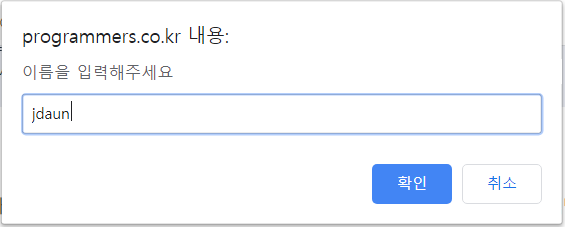

# JavaScript 이론  
이 문서는 프로그래머스 사이트의 강의 중 [Hello, JavaScript](https://programmers.co.kr/learn/courses/3#introduction)를 듣고 필기 기록용으로 작성한다.  
이후, 실습 중 습득한 추가적인 지식들 또한 추가될 예정이다.

# 목표  
 _2020-01-10 ~ 2020-01-11(완료)_  
총 강의시간이 2시간 16분 48초로 꽤 짧기 때문에 최대 이틀을 목표로 완성하도록 한다.  

# 목차  
* [실습환경 만들기](#실습환경-만들기)     
* [변수 선언과 초기화](#변수-선언과-초기화)  
* [기본자료형](#기본자료형)  
* [Number](#number)  
* [String](#string)  
* [Object](#object)  
* [undefined와 null](#undefined와-null)  
* [산술연산자](#산술연산자)  
* [함수 사용하기](#함수-사용하기)  
* [관계연산자](#관계연산자)  
* [논리연산자](#논리연산자)  
* [연산자 우선순위](#연산자-우선순위)  
* [String 이어붙이기](#string-이어-붙이기)  
* [String 다루기](#string-다루기)  
* [배열 만들기](#배열-만들기)  
* [배열 사용하기](#배열-사용하기)  
* [If문](#if문)  
* [switch문](#switch문)  
* [do,while문](#do-while문)  
* [for문](#for문)  
* [변수의 Scope](#변수의-scope)  
* [method, this](#method-this)  
* [클로저(closure)](#클로저closure)  
* [마무리하며-0112수정](#마무리하며)

# 실습환경 만들기  
## JavaScript의 특징  
* HTML, CSS와 함께 clinet side 웹 프로그램을 작성할 수 있다.  
* 문법이 쉽고 브라우저에서 바로 실행 가능하다. => 처음 배우기에 매우 좋은 언어  

## 실습환경  
* 나는 웹에디터로 아톰, 브라우저는 크롬 환경에서 실습을 진행하였다.  
* html파일에 외부 js파일을 로드한 후, 크롬으로 html파일을 열면 js파일 내 코드 동작을 확인할 수 있다.  

# 크롬 Developer Console 사용하기  
## 개발자 도구(Developer Console)  
* 크롬 브라우저의 우측 상단에서 1)더보기-개발자도구 메뉴 또는 2)F12로 활성화  
* 여러 탭 중 console탭을 사용해 console을 확인 가능  
* 직접 명령어를 입력해 실행 가능하며(>), 그 결과를 바로 확인 가능(<)  
* 깨끗하게 청소하기 단축키 - ctrl+l 또는 clear()

## console.log  
* console.log뒤에 따라오는 괄호 안에 들어있는 콘솔창에 출력하는 명령어  
* 여러 줄의 js코드를 작성하여 프로그램을 만들 수 있으며, 프로그램의 실행순서는 순차적으로 실행된다.  
* 괄호 안에 여러 개의 메시지를 콤마(,)로 구분하여 활용할 수도 있음
  ````javascript
  console.log("hello", "daun");
  ````

# 변수 선언과 초기화  
## 변수  
* 임의의 값을 저장해두고 읽을 수 있는 가상의 공간  
* 변수의 선언과 초기화  
  * 선언: 컴퓨터에게 변수를 사용할 것이라고 알려주는 역할  
  * 초기화: 선언한 변수에 처음으로 값을 저장하는 과정  
  * 변수에 값을 저장하는 법: 대입연산자(=)를 활용  
  * 콤마(,)를 활용해 여러 변수를 동시에 선언, 초기화 가능  
  ```` javascript
  var variable_name;
  variable_name = value;
  ````
## prompt() 명령어
* prompt뒤에 따라오는 괄호 안에 들어있는 메시지를 사용자에게 보여주고, 문자열을 입력받는 명령  
  * 변수에 값을 저장하는 구문과 함께 사용해서, 사용자가 입력한 값을 변수에 저장 가능  
  ```` javascript
  var name=prompt("이름을 입력해주세요");
  ````
  

# 기본자료형  
## 자료형이란?  
* 변수에 저장할 수 있는 값의 종류  
* 자료형의 종류  
  * number Type: 숫자  
  ```` javascript
  var a = 100, b=3.14;
  ````
  * string Type: 문자열
  ```` javascript
  var c="안녕하세요", d="a";
  ````
  * boolean Type: 맞다/틀리다 표현
  ```` javascript
  var e = true, f = false;
  ````
## typeof()명령어
* typeof뒤에 따라오는 괄호 안에 들어있는 변수의 type을 알려주는 명령어
  ````javascript
  var a = 100;
  console.log(a, typeof(a)); //100 "number"
  ````
* 개발자 도구에서는 이름이나 명령어만 입력해도 변수의 type을 알 수 있다.

# Number
* 숫자를 나타내는 자료형  
* 64bit로 실수와 정수 모두 표현 가능
* 정상적이지 않는 숫자나 표현할 수 없는 범위의 수를 표시하는 NaN, Infinity

## parseInt, parseFloat 명령어
* 문자열"1"과 1은 다름
* 명령어 뒤에 따라오는 괄호 안에 있는 문자열의 앞에서부터 Number를 인식함

# String
* 따옴표('), 큰 따옴표(")로 감싸서 문자열 표현
* 문자열 안에 따옴표, 큰따옴표 등의 문자를 활용하려면 escape character를 활용
  * escape character는 역슬래시(\)로 사용
  * 줄바꿈 : \n
  * 따옴표 : \'
  * 큰따옴표 : \"
  * 역슬래시 : \\
  
# Object
* number, string, boolean의 단순 자료형보다 더 복잡한 자료를 표현할 때 사용
## 객체를 만드는 방법
* 중괄호{}를 사용해 정의
* 객체는 속성의 집합으로 이뤄짐
* 객체의 속성은 모든 자료형이 가능, object 포함
```` javascript
var man={name:"홍길동", age:20, height:180};
````
## 객체의 속성에 접근하는 법
* 객체 이름 뒤에 점(.)을 사용하여 접근 가능
* 객체 이름 뒤에 대괄호([])안에 속성 이름을 문자열로 적어서 접근 가능
```` javascript
console.log(man.name);
console.log(man[name]);
````

```javascript
var 다운 = {
    이름 : '다운',
    나이 : 25,
    성격 : '온화함',
    먹다 : function 먹다(){
        console.log("과자를 먹다")
    },
}

var 값 = '이름'
다운.값 // X
다운[값] //'다운'출력
```
* 속성 값 변경은 속성에 접근해서 변수에 값을 저장하듯이 하면 된다.
* 문자열의 경우 .을 찍는 순간 문자객체로 인식하게 된다. []로도 각 문자에 접근할 수 있다.
```
'안녕하세요'[0] //안
'안녕하세요'.length //5
'*'.repeat() //*****
```

## undefined
* 시스템에서 어떤 변수나 속성이 정의되지 않은 경우를 표현
  * 선언만 하고 초기화가 되지 않는 변수의 타입이나 값
  * 객체에 정의되지 않은 속성의 타입이나 값
## null
* 개발자가 명시적으로 아무것도 없는 비어있는 상태를 나타낼 때 사용
* 객체의 속성을 비울때 사용
  * typeof의 결과는 object이며 값은 null
  
# 산술연산자
## 이항연산자
두개의 피연산자(A,B)를 가지는 연산자.  
__A연산자B__ 의 꼴로 사용함. 피연산자는 변수나 숫자가 될 수 있음.  
* + 더하기
* - 빼기
* * 곱하기
* / 나누기
* % 나머지
## 단항연산자
__연산자A__ 의 꼴로 사용함. 대표적으로 -연산자가 있다. -A

증감연산자(++,--)  
표현식 안에서 변수의 값을 증가하거나 감소시킬 수 있음.  
연산자를 변수 앞에 사용한 경우와 변수 뒤에 사용한 경우에 따라 변수의 값을 업데이트 하는 순서가 바뀜.

## Math관련 명령어
* Math.pow(A,b): A의 B승을 구해줌
* Math.sqrt(A) : A의 제곱근을 구해 줌
* Math.random() : 0~1 사이의 임의의 난수를 발생시켜 줌

# 함수 사용하기
## 함수의 정의
호출에 의해 여러번 실행할 수 있는 코드 블럭  
* 반복되는 코드 감소
* 코드의 개발 및 수정 용이
  ````javascript
  function 함수이름(파라미터1, 파라미터2){
    /*
        실행될 코드
    */
    return 반환값;
   }
   ````
## 함수의 호출 방법
__함수이름(인자, ...)__ 의 형태로 호출

## repeat()
문자열을 반복한 값을 반환하는 메서드    
```javascript
for(var star = 5; star >= 1; star--){
  console.log('*'.repeat(star));
}
```

# 관계연산자
두 표현식(A, B)의 관계를 비교하는 이항연산자. 관계에 따라 boolean 타입의 true, false로 표현됨.  
< > <= >= == !=  

# 논리연산자
두 boolean 피연산자에 대해 연산하는 연산자.

### AND(&&) 연산자
두 피연산자가 모두 true인 경우에만 true를 나타내는 이항연산자

## OR(||) 연산자
두 피연산자가 하나라도 true인 경우 true를 나타내는 이항연산자

## NOT(!) 연산자
피연산자가 true인 경우 false를, false인 경우 true를 나타내는 단항연산자

# 연산자 우선순위
수학에서 곱하기를 더하기보다 먼저 계산하는 것 처럼, Javascript에서도 연산자에 우선순위가 존재.

## 우선순위 순으로 정리한 연산자
* ++, --
* !
* *, /, %
* * +, -
* <, <=, >, >=
* ==, !=
* &&
* ||

## 괄호
우선순위를 명시하기 위해 괄호를 사용. 괄호안의 계산식이 먼저 계산됨.

# String 이어 붙이기
## 문자열 길이 알아내기
* 문자열의 .length 속성 이용 
## 문자열 붙이기
1. .concat 함수 사용
    * str1.concat(str2)
2. 더하기(+)연산자 사용
    * str1+str2  
  
# String 다루기
## 특정 위치의 문자열 알아내기
* .charAt 함수 이용
  * 첫 문자: str.charAt(0);
  * 마지막 문자: str.charAt(str.length-1);
* 대괄호([]) 사용
  * 첫 문자: str[0]
  * 마지막 문자: str[str.length-1];

## 부분문자열 구하기
문자열의 연속된 일부분 구하는 함수
* .substring(pos1, pos2): pos1에서 pos2까지의 부분 문자열 반환
  * pos2생략시 pos1에서부터 마지막까지의 문자열 반환
* substr(pos, length): pos에서 length길이 만큼의 부분 문자열 반환
  * length생략 시, pos에서 마지막까지의 문자열 반환
  * pos가 음수인 경우, str.length-pos로 동작
  
## 문자열 검색하기
* indexOf(str);
* lastIndexOf(str);

# 배열 만들기
## 배열
값을 저장할 수 있는 엘리먼트(변수)의 연속된 공간. 주소(인덱스, index)를 이용해 각 엘리먼트에 접근 가능.
값 그룹화는 하고 싶지만 속성 이름을 따로 주고 싶지 않을 때 배열 사용.  

  
배열은 값들의 나열, 객체와 달리 이름이 따로 존재하지 않고 숫자로 이루어 지는 인덱스가 있다.  

### 배열의 정의
* 빈 배열 : var arr=[];
* 초기화된 배열 : var arr=[1,2,3,4,5];
* 엘리먼트에는 어떤 자료형이든 저장될 수 있음
  * var mixed_arr = [ 1, true, 3.14, "string", {name:"object"}, [1,2,3] ];
  
### 배열의 길이
* .length속성 이용

### 배열의 엘리먼트에 접근하기
* 대괄호 안에 인덱스를 사용 : arr[index]
  * arr[0] = 1
  * console.log(arr[arr.length-1]);
  
### 배열과 배열객체 구분하기
Array.isArray()를 사용하여 판별한다.
```javascript
var 배열 = ['사과', '오렌지', '포도']
var 배열같은객체 = {
    0: '고양이',
    1: '토끼',
    2: '강아지',
}
Array.isArray(배열) //true
Array.isArray(배열같은객체) //false
```

# 배열 사용하기
## 배열에 엘리먼트 추가/삭제하기
기본적으로 배열의 앞과 뒤에서 엘리먼트를 추가하거나 삭제할 수 있음.
* .push(element) : 배열의 뒤에 엘리먼트 추가
* .pop() : 배열의 뒤에서 엘리먼트 삭제하고 리턴
* .shift() : 배열의 앞에서 엘리먼트 삭제하고 리턴
* .unshift(element) : 배열의 앞에 엘리먼트 추가
* .reverse(): 배열을 뒤집음
* .sort(): 배열 값을 정렬함

## 배열 붙이기, 검색하기
* arr1.concat(arr2) : arr1과 arr2 붙임
* arr.indexOf(element) : arr에서 element가 있는 첫 위치를 검색
* arr.lastIndexOf(element) : arr에서 element가 있는 마지막 위치를 검색

## 문자열 split함수
* 문자열을 구분자로 나눠서 각각을 담은 배열을 반환하는 함수
````javascript
var str="1,2,3,4,5";
str.split(",");
````
결과  
````javascript
arr = ["1","2","3","4","5"];
````

# If문  
# 조건문  
조건에 따라 프로그램의 흐름을 분기해서 특정 코드가 실행되도록 함  

# switch문  
## switch, case  
조건에 따라 프로그램의 흐름을 분기해서 특정 코드가 실행되도록 함  

## break  
break구문을 만나면, switch-case 문의 마지막 중괄호(}) 밖으로 빠져나옴.  
* break를 사용하지 않으면, switch문에서 빠져나오지 않고 다음 case에 해당하는 코드까지 실행됨.

# while문
# 반복문
조건에 따라 프로그램의 일정 코드를 반복적으로 수행할 수 있도록 하는 구문  

## continue, break;
* continue : 남은 반복실행될 코드를 모두 skip  
* break : 반복문에서 즉시 탈출

# do, while문
한번은 코드가 실행되고, 이후에 반복실행될지 말지를 결정
## 조건식이 거짓(False) 일 때,
* while : 한번도 실행되지 않음
* do, while : 한번은 실행되고 종료

# for문
초기구문, 업데이트 구문, 반복조건 을 한 구문에 합친 반복문.

## for in문
객체의 각 엘리먼트에 접근할 수 있는 반복문.
````javascript
for(var e in obj){
  console.log(e,":",obj[e]);
}
````

# 변수의 Scope
선언된 변수가 유효한 영역
## function scope
* 선언된 변수는 선언된 함수 안에서 접근 가능
* 선언된 함수 안에서 선언된 함수 (nested function)에서도 접근 가능

# 변수의 shadowing(쉐도잉)
* 함수 안에서 밖에서도 선언되었던 같은 이름의 변수를 사용하는 경우
  * 함수 밖의 변수는 잠시 가려짐 (shadowing)
  * 함수 안에서는 해당 함수에서의 변수를 사용 (함수 밖 변수의 값은 변하지 않음)
  * 함수에서 빠져나오면 다시 바깥 변수에 접근할 수 있음
  
  함수 안에서만 값이 유지되어야 하는 경우

* 함수 안에서 var 키워드를 사용해 선언하고 사용
  * 여러 함수에서 값이 유지되면서 사용되는 변수의 경우
  * 함수를 포괄하는 곳에서 선언하고 사용
  
# method, this
method는 객체의 속성값에 사용될 수 있다.

```` javascript
function f(){
  console.log(this);
  console.log(f is called");
}

function setName(name){
  this.name=name;
}

var o ={name:"object", method:f, setName:setName};
var o2={name:"", setName:setName);

o.setName("object1");
o2.setName("object2");

console.log(o, o2);
````

## 실행결과
  

* 일반적인 함수를 호출할 때, 해당 함수 내부에서 사용된 this는 전역객체(브라우저의 경우 window객체)에 바인딩된다.

* 함수를 객체의 속성값을 메소드로 저장을 해두고 호출하면 그 함수 안에서 어떤 객체가 그 함수를 호출하였는지 this키워드를 이용해 접근할 수 있다.

# 클로저(Closure)
* 함수, 함수가 선언될 때의 envireonment로 구성
* 함수, 함수가 선언될 때의 environment로 구성
* 함수가 정의 될 때의 environment가 함께 closure로 결합되면서, 다양한 활용이 가능

````javascript
function makeCounterFunction(initVal){
    var count = initVal;
    function Increase(){
        count++;
        console.log(count);
    }
    return Increase;
}

var counter1 = makeCounterFunction(0);
var counter2 = makeCounterFunction(10);
````

* counter1의 closure  
 * 함수 : function Increase(){}  
 * 환경 : var count = 0;  
 * counter2의 closure  
* counter2의 closure  
 * 함수 : function Increase(){}  
 * 환경 : var count = 10;  

# 마무리하며
_(20-01-12)_  
this,클로저는 생소한 개념으로 더 깊이 있는 학습과 실습이 필요한 것 같다.  
이후, react나 node.js를 이용한 간단한 프로젝트를 만들어 보도록 하자.
